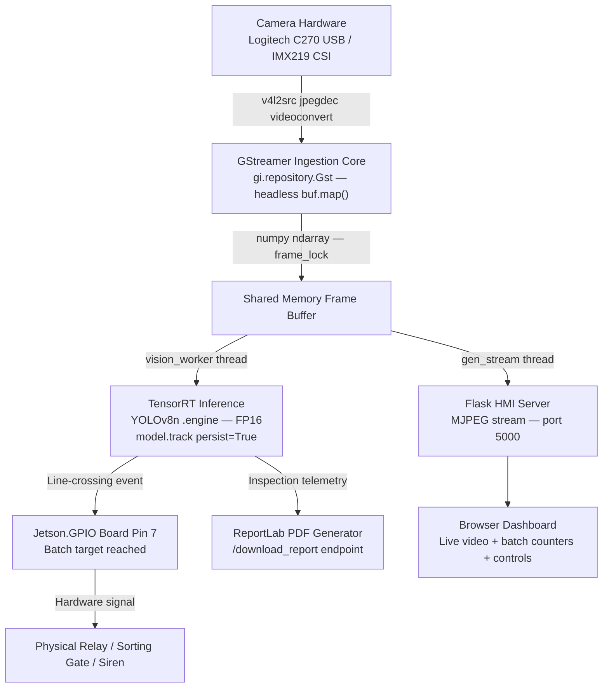

# EdgeForge-Vision 🚀

> An Open-Source Edge-AI Framework for Accelerated Industrial Inspection, Real-Time Object Telemetry, and Asynchronous HMI Controls on NVIDIA Jetson.

[](https://www.nvidia.com/en-us/autonomous-machines/embedded-systems/)
[-blue.svg)](https://developer.nvidia.com/embedded/jetpack)
[](https://developer.nvidia.com/tensorrt)
[](https://www.python.org/)
[](LICENSE)

EdgeForge-Vision is an open-source, edge-accelerated framework for high-speed industrial product inspection and line-crossing telemetry on the NVIDIA Jetson platform. It delivers a complete, end-to-end pipeline — from zero-copy GStreamer camera ingestion and TensorRT deep learning inference, to GPIO-driven physical automation and a live Flask HMI dashboard with automated PDF compliance reporting.

Built on a **decoupled, multi-threaded architecture**, the core engine is entirely agnostic to specific model weights, enabling seamless redeployment across diverse industrial environments without modifying the pipeline logic.

**Live Validation Prototype:** Successfully deployed as an automated agricultural conveyor-sorting system for industrial coconut counting and batch management. See the HMI Dashboard screenshot
 for a real deployment view.
 
---

## 📋 Table of Contents

- [Key Features](#-key-features)
- [System Architecture](#-system-architecture)
- [Hardware & Software Stack](#-hardware--software-stack)
- [Camera Configuration & GStreamer Pipeline](#-camera-configuration--gstreamer-pipeline)
- [Dataset & Training Specifications](#-dataset--training-specifications)
- [Performance Benchmarks](#-performance-benchmarks)
- [Industrial Application Use Cases](#-industrial-application-use-cases)
- [Getting Started](#-getting-started)
- [Custom Adaptation Guide](#-custom-adaptation-guide)
- [Flask Telemetry Dashboard & REST API](#-flask-telemetry-dashboard--rest-api)
- [GPIO Hardware Interfacing](#-gpio-hardware-interfacing)
- [Automated PDF Reporting](#-automated-pdf-reporting)
- [Model Weights & Runtime Prerequisites](#-model-weights--runtime-prerequisites)
- [Repository Structure](#-repository-structure)
- [Case Study](#-case-study-industrial-coconut-counting--batch-management)
- [Engineering Roadmap](#-engineering-roadmap)
- [License](#-license)

---

## 🌟 Key Features

- **Zero-Copy GStreamer Pipeline:** Uses `gi.repository.Gst` to pull video buffers directly via OS memory mapping (`buf.map()`), bypassing display servers entirely — purpose-built for headless SSH deployments.
- **Hardware-Accelerated TensorRT Inference:** FP16 quantization on native Jetson CUDA cores delivers **40–50 FPS** real-time throughput — a **3–4× uplift** over standard PyTorch.
- **Real-Time Object Tracking:** Persistent multi-object tracking with unique IDs (`model.track(persist=True)`) powering accurate line-crossing event detection on active conveyor feeds.
- **Multi-Threaded Flask HMI Dashboard:** Asynchronous MJPEG live stream with per-frame bounding boxes, batch counters, and operational controls — all accessible from any browser on the local network.
- **Configurable Line-Crossing Telemetry:** Dynamically adjustable virtual inspection line via REST API, tracking top-to-bottom object movement through a defined Region of Interest (ROI).
- **GPIO Physical Automation:** `Jetson.GPIO` integration on Board Pin 7 triggers physical relays, sorting gates, or sirens the moment a batch target is reached.
- **Automated PDF Telemetry Reports:** ReportLab-powered compliance logs with batch counts, target setpoints, and event timestamps — downloadable directly from the dashboard.
- **Session Video Recording:** On-demand MP4 recording of the live inspection feed via `cv2.VideoWriter`, stored locally with timestamped filenames.
- **Model-Agnostic Design:** Swap the `.engine` file and update two config lines to retarget the entire pipeline to any inspection domain.

---

## 🏗️ System Architecture

EdgeForge-Vision is built on a **decoupled, multi-threaded pipeline design pattern**. The vision loop, Flask server, and GPIO actuation run in fully isolated threads, synchronized via `threading.Lock()` to guarantee zero race conditions across the shared frame buffer.

```
[ Camera Hardware ]
  Logitech C270 USB / IMX219 CSI
         │
         ▼
[ GStreamer Ingestion Core ]          ← gi.repository.Gst — headless, zero-copy buf.map()
  v4l2src → jpegdec → videoconvert
         │
         ▼
[ Shared Memory Frame Buffer ]        ← numpy ndarray — thread-isolated via frame_lock
         │
    ┌────┴─────────────────────┐
    │                          │
    ▼                          ▼
[ TensorRT Inference ]    [ Flask HMI Server ]     ← http://0.0.0.0:5000
  YOLOv8n .engine FP16      MJPEG Stream
  model.track(persist=True)  REST API Endpoints
    │                          │
    ▼                          ▼
[ Line-Crossing Logic ]   [ Browser Dashboard ]
  ROI + ID tracking          Live video + counters
    │
    ├──► [ Jetson.GPIO Pin 7 ]  ← Relay / Sorting Gate trigger on batch target
    │
    └──► [ ReportLab PDF ]      ← /download_report — compliance log export
```



---

## ⚙️ Hardware & Software Stack

### Hardware Requirements

| Component | Specification |
| :--- | :--- |
| Edge Compute Platform | NVIDIA Jetson Orin Nano Developer Kit |
| Camera — USB (Validated) | Logitech C270 HD Webcam (640×480 @ 30fps via V4L2) |
| Camera — CSI (Supported) | IMX219 CSI Camera Module (MIPI CSI-2 interface) |
| GPIO Automation Target | Relay module / pneumatic valve / industrial siren — Board Pin 7 |

### Software Environment

| Layer | Details |
| :--- | :--- |
| OS | Linux for Tegra (L4T) / Ubuntu 22.04 LTS |
| SDK | NVIDIA JetPack 6.0 |
| CUDA / cuDNN / TensorRT | CUDA 12.x, cuDNN 8.x+, TensorRT 9.x/10.x |
| Language | Python 3.10 |
| Deep Learning | PyTorch (Jetson-compatible wheel), Ultralytics YOLOv8 |
| Vision Pipeline | GStreamer (`gi.repository.Gst`), OpenCV |
| HMI Server | Flask (multi-threaded, MJPEG streaming) |
| GPIO | Jetson.GPIO |
| Reporting | ReportLab |

---

## 📷 Camera Configuration & GStreamer Pipeline

EdgeForge-Vision uses `gi.repository.Gst` — not OpenCV's `VideoCapture` — for direct OS-level memory-mapped frame acquisition. This is the key to its headless performance: frames are pulled from kernel buffers via `buf.map(Gst.MapFlags.READ)` and cast directly into numpy arrays, with **no display server, no X11, no window management overhead**.

### Validated: Logitech C270 USB Webcam (640×480 @ 30fps)

This is the production-validated pipeline used in `app.py`:

```python
import gi
gi.require_version('Gst', '1.0')
from gi.repository import Gst
import numpy as np

Gst.init(None)

def start_camera():
    gst_str = (
        "v4l2src device=/dev/video0 ! "
        "image/jpeg, width=640, height=480, framerate=30/1 ! "
        "jpegdec ! videoconvert ! video/x-raw, format=BGR ! "
        "appsink name=sink emit-signals=true sync=false max-buffers=2 drop=true"
    )
    pipeline = Gst.parse_launch(gst_str)
    sink = pipeline.get_by_name("sink")
    pipeline.set_state(Gst.State.PLAYING)
    return pipeline, sink

def get_frame(sink):
    sample = sink.emit("pull-sample")
    if sample is None:
        return None
    buf = sample.get_buffer()
    caps = sample.get_caps()
    h = caps.get_structure(0).get_value('height')
    w = caps.get_structure(0).get_value('width')
    success, map_info = buf.map(Gst.MapFlags.READ)
    if not success:
        return None
    frame = np.ndarray((h, w, 3), buffer=map_info.data, dtype=np.uint8).copy()
    buf.unmap(map_info)
    return frame
```

> **Pipeline Design Notes:**
> - `max-buffers=2 drop=true` on the appsink prevents buffer backlog under sustained inference load — the pipeline always serves the freshest frame.
> - `sync=false` disables clock synchronization, eliminating artificial latency introduced by audio/video sync waiting.
> - JPEG hardware decode via `jpegdec` offloads CPU decompression before the frame reaches the inference thread.

### Supported: IMX219 CSI Camera (MIPI CSI-2)

For native CSI deployments leveraging the Jetson's NVMM zero-copy memory path:

```python
gst_str = (
    "nvarguscamerasrc ! "
    "video/x-raw(memory:NVMM), width=1920, height=1080, framerate=30/1 ! "
    "nvvidconv ! "
    "video/x-raw, format=BGRx ! "
    "videoconvert ! "
    "video/x-raw, format=BGR ! "
    "appsink name=sink emit-signals=true sync=false max-buffers=2 drop=true"
)
```

> CSI pipelines use `nvarguscamerasrc` and `nvvidconv` to keep frame data in NVMM (NVIDIA shared memory) until the final colorspace conversion — maximizing bandwidth efficiency.

---

## 📊 Dataset & Training Specifications

The default model was trained on a custom industrial agricultural dataset for coconut counting and quality grading, serving as the live validation prototype for this framework.

### Dataset Split

| Split | Images | Notes |
| :--- | :---: | :--- |
| Train | 1,303 | Primary training set |
| Validation | 371 | 13,488 labeled object instances — dense annotation |
| Test | 187 | Held-out evaluation set |
| **Total** | **1,861** | 70 : 20 : 10 industry-standard split |

### Training Configuration

| Parameter | Value |
| :--- | :--- |
| Model Architecture | YOLOv8n (Nano) |
| Model Complexity | 73 layers · 3,005,843 parameters · 8.1 GFLOPs |
| Training Environment | Google Colab — Tesla T4 GPU |
| Epochs | 120 |
| Training Duration | 1.308 hours |
| Image Size | 640 × 640 |

### Validation Metrics

| Metric | Score |
| :--- | :---: |
| Precision (P) | **0.943** |
| Recall (R) | **0.874** |
| mAP@50 | **0.921 (92.1%)** |
| mAP@50-95 | **0.766** |

---

## ⚡ Performance Benchmarks

TensorRT FP16 compilation delivers a **3–4× throughput improvement** over standard PyTorch inference on the Jetson Orin Nano, crossing the real-time threshold for industrial deployment.

| Model Configuration | Precision | Throughput |
| :--- | :---: | :---: |
| YOLOv8n — Standard PyTorch `.pt` | FP32 | ~10–15 FPS |
| **YOLOv8n — EdgeForge TensorRT `.engine`** | **FP16** | **~40–50 FPS ✅** |

> Benchmarks recorded on Jetson Orin Nano at 15W power mode, 640×480 input resolution. Results may vary with Jetson power mode (15W vs 7W) and input resolution.

---

## 🏭 Industrial Application Use Cases

EdgeForge-Vision decouples hardware ingestion from model weights. Swap the `.engine` file and update two config constants in `app.py` to retarget the entire pipeline to any inspection domain — no pipeline code changes required.

| Industry Sector | Telemetry Task | Custom Model Target | GPIO Response (Pin 7) |
| :--- | :--- | :--- | :--- |
| Agricultural Automation | Coconut counting & batch management | `coconut.engine` | Triggers sorting gate when batch target is reached |
| Beverage Packaging | Bottle fill-level volumetric control | `bottle_counter.engine` | Diverts underfilled containers into quarantine bins |
| Pharma Operations | Blister pack defective pill tracking | `pill_anomaly.engine` | Halts delivery conveyor and triggers warning siren |
| Logistics & Warehousing | Package parcel sorting & classification | `package_type.engine` | Activates directional actuator to route boxes into correct chutes |

---

## 🚀 Getting Started

### 1. Clone the Repository

```bash
git clone https://github.com/m7hanan/EdgeForge-Vision.git
cd EdgeForge-Vision
```

### 2. Configure CUDA Environment

Add CUDA paths to your `~/.bashrc` and reload:

```bash
export PATH=/usr/local/cuda/bin:$PATH
export LD_LIBRARY_PATH=/usr/local/cuda/lib64:$LD_LIBRARY_PATH
source ~/.bashrc
```

### 3. Install the Jetson-Optimized PyTorch Wheel

Download `torch-2.0.0+nv23.05-cp38-cp38-linux_aarch64.whl` from the [Releases page → Tag v1.0.0](../../releases/tag/v1.0.0), then install:

```bash
pip install torch-2.0.0+nv23.05-cp38-cp38-linux_aarch64.whl
```

### 4. Install Remaining Dependencies

```bash
pip install -r requirements.txt
```

### 5. Deploy Model Weights

Download the remaining validated assets from the [Releases page → Tag v1.0.0](../../releases/tag/v1.0.0) and place them at:

```
EdgeForge-Vision/
└── models/
    ├── best.pt
    ├── best.engine
    ├── yolov8n.pt
    └── yolov8n.engine
```

### 6. Launch the Framework

```bash
sudo python app.py
```

Open a browser and navigate to `http://<jetson-ip>:5000` to access the live HMI dashboard.

> `sudo` is required for `Jetson.GPIO` hardware access.

---

## 🔧 Custom Adaptation Guide

Follow these steps to retrain and redeploy EdgeForge-Vision for any industrial inspection domain.

### Step 1 — Collect & Train Custom Weights

Label a domain-specific dataset, then train on Google Colab or a cloud GPU cluster:

```bash
pip install ultralytics
yolo task=detect mode=train model=yolov8n.pt data=your_dataset.yaml epochs=120 imgsz=640
```

Extract `best.pt` from `runs/detect/train/weights/best.pt`.

### Step 2 — Export to TensorRT Engine

Run **on the Jetson device** to compile a hardware-serialized FP16 engine:

```python
from ultralytics import YOLO

model = YOLO("models/best.pt")
model.export(format="engine", half=True, device=0)
# Output: models/best.engine
```

### Step 3 — Deploy Weights

Transfer `best.pt` and `best.engine` to the Jetson and place both under `EdgeForge-Vision/models/`.

### Step 4 — Update Runtime Configuration

Open `app.py` and update these constants at the top of the file:

```python
# Path to your compiled TensorRT binary
MODEL_PATH = "models/best.engine"

# Batch size that triggers the GPIO relay on Board Pin 7
state = {
    "target": 500,          # Update to your production batch target
    "line_y_ratio": 0.25,   # Vertical position of the counting line (0.0 = top, 1.0 = bottom)
    "roi": {"x1": 142, "y1": 82, "x2": 466, "y2": 478},  # Region of Interest bounds
    ...
}
```

> The counting line position and ROI can also be updated live at runtime via the REST API without restarting the server.

### Step 5 — Launch & Monitor

```bash
sudo python app.py
```

Navigate to `http://<jetson-ip>:5000` and use the dashboard controls to start inspection.

---

## 🖥️ Flask Telemetry Dashboard & REST API

The HMI layer is a **multi-threaded Flask web application** served at `http://0.0.0.0:5000`. The vision worker thread encodes frames as JPEG at quality 70 into a shared `latest_jpeg` buffer; the Flask stream thread reads from this buffer at 30fps via MJPEG — keeping inference latency completely decoupled from network delivery speed.

### Live Dashboard Features

- **MJPEG Video Stream:** Real-time camera feed at `/video` with bounding boxes, ROI rectangle, and counting line rendered per-frame.
- **Batch Counter Panel:** Live running count against the configured target setpoint.
- **Last Event Log:** Timestamp of the most recent detected line-crossing event.
- **Operational Controls:** Start / Stop inference, Reset batch, adjust line position and target — all without restarting the server.
- **Recording Controls:** Start / Stop MP4 session recording saved to `record/` with timestamped filenames.
- **Report Download:** One-click PDF compliance report export at `/download_report`.

---

**Live HMI Dashboard — Industrial Coconut Counter**


*Dark-themed industrial dashboard running on the Jetson Orin Nano — showing the live 640×480 MJPEG feed with ROI bounding box (blue) and configurable crossing line (yellow), real-time batch count (0/2000), completion rate, and the control sidebar with START/STOP/RESET, target configuration, and dynamic crossing line position adjustment.*

---

### REST API Reference

| Method | Endpoint | Description |
| :---: | :--- | :--- |
| `GET` | `/` | Serve the HMI dashboard (`index.html`) |
| `GET` | `/video` | MJPEG live stream with inference overlay |
| `GET` | `/api/status` | Returns full system state as JSON |
| `POST` | `/api/start` | Start inference and line-crossing detection |
| `POST` | `/api/stop` | Pause inference (camera ingestion continues) |
| `POST` | `/api/reset` | Reset batch counter, clear tracking state, release GPIO |
| `POST` | `/api/target` | Set batch target `{"target": 500}` |
| `POST` | `/api/line` | Adjust counting line `{"line_y_ratio": 0.35}` |
| `POST` | `/api/record_start` | Begin MP4 session recording |
| `POST` | `/api/record_stop` | End MP4 session recording |
| `GET` | `/download_report` | Generate and download PDF telemetry report |

### `/api/status` Response Schema

```json
{
  "running": true,
  "recording": false,
  "count": 147,
  "target": 2000,
  "line_y_ratio": 0.25,
  "last": "14:32:07",
  "roi": {"x1": 142, "y1": 82, "x2": 466, "y2": 478}
}
```

---

## 🔌 GPIO Hardware Interfacing

Physical automation is driven by `Jetson.GPIO` on **Board Pin 7**. The GPIO pin is initialized to `LOW` at startup. When the running object count reaches or exceeds the configured `target`, the pin is driven `HIGH` — triggering the connected relay, sorting gate, or siren.

```python
import Jetson.GPIO as GPIO

# Initialization (runs at app startup)
GPIO.setmode(GPIO.BOARD)
GPIO.setup(7, GPIO.OUT)
GPIO.output(7, GPIO.LOW)

# Triggered inside vision_worker when count >= target
if current_count >= target:
    GPIO.output(7, GPIO.HIGH)

# Batch reset via /api/reset — releases the relay
GPIO.output(7, GPIO.LOW)
```

**Safe Shutdown:** A `cleanup()` function registered via `atexit` drives Pin 7 `LOW` and calls `GPIO.cleanup()` on every exit path — including exceptions and `Ctrl+C`.

```python
import atexit

def cleanup():
    GPIO.output(7, GPIO.LOW)
    GPIO.cleanup()

atexit.register(cleanup)
```

> Always wire your relay with an appropriate flyback diode and current-limiting circuit. Never connect inductive loads directly to the Jetson GPIO pins.

---

## 📄 Automated PDF Reporting

The `/download_report` endpoint triggers instant PDF generation via the **ReportLab canvas engine**. Reports are structured as industrial compliance documents and returned as an immediate file download.

Each report captures:

- Report title and generation timestamp
- Total counted quantity for the current session
- Configured batch target setpoint
- Timestamp of the last detected counting event

```python
from reportlab.pdfgen import canvas
from datetime import datetime

@app.route("/download_report")
def download_report():
    pdf_path = "industrial_report.pdf"
    c = canvas.Canvas(pdf_path)
    c.setFont("Helvetica-Bold", 16)
    c.drawString(50, 750, "INDUSTRIAL COCONUT COUNTER PRODUCTION REPORT")
    c.setFont("Helvetica", 12)
    c.drawString(50, 720, f"Generated: {datetime.now().strftime('%Y-%m-%d %H:%M:%S')}")
    with lock:
        c.drawString(50, 680, f"Total Counted Quantity: {state['count']} units")
        c.drawString(50, 660, f"Target Setpoint Limit:  {state['target']} units")
        c.drawString(50, 640, f"Last Logged Event:      {state['last']}")
    c.save()
    return send_file(pdf_path, as_attachment=True)
```

Reports are also written to disk at `industrial_report.pdf` for local archiving.

---

## 📦 Model Weights & Runtime Prerequisites

Production model weights and the Jetson-optimized PyTorch wheel are excluded from the main git tree to keep clone times fast.

**Download all validated assets from the [Releases page → Tag v1.0.0](../../releases/tag/v1.0.0).**

| Asset | Description | Approx. Size |
| :--- | :--- | :---: |
| `best.pt` | Custom-trained YOLOv8n PyTorch weights | ~6 MB |
| `best.engine` | TensorRT FP16 compiled engine (Jetson Orin Nano) | ~8 MB |
| `yolov8n.pt` | Base YOLOv8n COCO weights | ~6 MB |
| `yolov8n.engine` | Base TensorRT FP16 engine | ~8 MB |
| `torch-2.0.0+nv23.05-cp38-cp38-linux_aarch64.whl` | Jetson-optimized PyTorch binary | ~164 MB |

---

## 📁 Repository Structure

```
EdgeForge-Vision/
├── models/                   # TensorRT .engine binaries and PyTorch .pt weights
│   └── .gitkeep              # Placeholder — populate with assets from Releases
├── record/                   # Timestamped MP4 session recordings (auto-created at runtime)
├── static/                   # Flask HMI stylesheets, icons, and dark-themed industrial assets
│   └── .gitkeep
├── templates/
│   └── index.html            # HTML5 responsive real-time HMI dashboard
├── app.py                    # Core application — GStreamer ingestion, TensorRT inference,
│                             #   Flask server, GPIO control, PDF reporting
├── requirements.txt          # Python dependency manifest
├── industrial_report.pdf     # Last generated PDF compliance report (runtime artifact)
├── .gitignore                # Excludes binaries, recordings, and OS artifacts
└── README.md                 # This file
```

---

## 📌 Case Study: Industrial Coconut Counting & Batch Management

EdgeForge-Vision was validated end-to-end as an automated agricultural conveyor-sorting system.

**The full pipeline executed on a single Jetson Orin Nano:**

- 1,861 images collected and labeled across three splits (70:20:10)
- Custom YOLOv8n trained for 120 epochs on a Tesla T4 — achieving **92.1% mAP@50** across 13,488 dense labeled instances in 1.308 hours
- Model compiled to TensorRT FP16 `.engine` directly on the Jetson
- Live conveyor feed ingested via Logitech C270 USB camera through the headless GStreamer pipeline
- Persistent object tracking with line-crossing logic counting coconuts at **40–50 FPS**
- GPIO Pin 7 driving a physical sorting gate relay upon batch target completion
- Batch telemetry and event logs exported as PDF compliance reports on demand

Zero modifications to the core pipeline logic were required between training and production deployment.

---

## 🗺️ Engineering Roadmap

- [ ] Multi-stream camera orchestration via NVIDIA DeepStream SDK
- [ ] Industrial fieldbus protocol layers: Modbus/TCP, MQTT broker, OPC-UA for PLC network synchronization
- [ ] INT8 quantization support for further latency reduction beyond FP16
- [ ] Cloud telemetry sync — push inspection logs and counts to remote dashboards via MQTT
- [ ] Expanded PDF reporting with embedded bounding-box frame thumbnails for visual audit trails
- [ ] Web-based ROI editor — drag-and-drop region and line configuration directly in the dashboard

---

## 📄 License

This project is licensed under the **MIT License** — see the [LICENSE](LICENSE) file for details.
