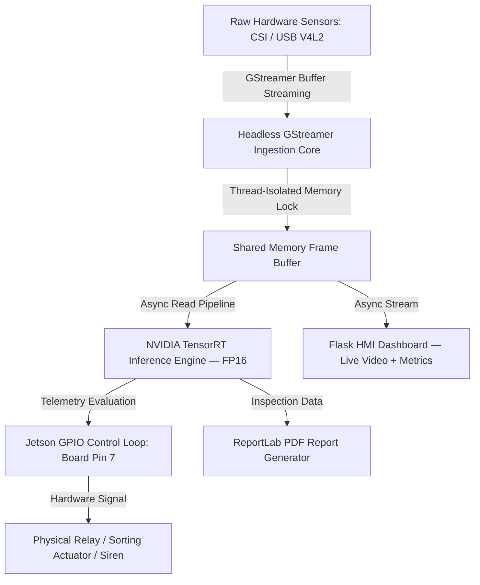

# EdgeForge-Vision 🚀

> An Open-Source Edge-AI Framework for Accelerated Industrial Inspection, Real-Time Object Telemetry, and Asynchronous HMI Controls on NVIDIA Jetson.

[](https://www.nvidia.com/en-us/autonomous-machines/embedded-systems/)
[-blue.svg)](https://developer.nvidia.com/embedded/jetpack)
[](https://developer.nvidia.com/tensorrt)
[](LICENSE)

EdgeForge-Vision bridges raw edge hardware and industrial monitoring by providing a complete, end-to-end pipeline — from hardware-accelerated camera ingestion and deep learning inference to GPIO-driven physical automation and real-time telemetry dashboards. Built on a **decoupled, multi-threaded architecture**, the core engine is entirely agnostic to specific model weights, enabling seamless redeployment across diverse industrial environments without modifying the pipeline logic.

---

## 📋 Table of Contents

- [Key Features](#-key-features)
- [System Architecture](#-system-architecture)
- [Hardware & Software Stack](#-hardware--software-stack)
- [Camera Configuration & GStreamer Pipeline](#-camera-configuration--gstreamer-pipeline)
- [Dataset & Training Specifications](#-dataset--training-specifications)
- [Performance Benchmarks](#-performance-benchmarks)
- [Industrial Application Use Cases](#-industrial-application-use-cases)
- [Getting Started](#-getting-started)
- [Custom Adaptation Guide](#-custom-adaptation-guide)
- [Flask Telemetry Dashboard](#-flask-telemetry-dashboard)
- [Automated PDF Reporting](#-automated-pdf-reporting)
- [GPIO Hardware Interfacing](#-gpio-hardware-interfacing)
- [Model Weights & Runtime Prerequisites](#-model-weights--runtime-prerequisites)
- [Repository Structure](#-repository-structure)
- [Roadmap](#-engineering-roadmap)
- [License](#-license)

---

## 🌟 Key Features

- **End-to-End Edge Pipeline:** Unified workflow covering hardware ingestion, model training, TensorRT deployment, and UI rendering — entirely on edge architecture.
- **GStreamer-Accelerated Ingestion:** Headless GStreamer pipeline streams CSI and USB camera frames directly into shared memory, bypassing desktop window management for maximum throughput.
- **Hardware-Accelerated Inference:** Native CUDA 12.x and TensorRT 9.x/10.x integration on NVIDIA JetPack 6, with FP16 precision quantization delivering **40–50 FPS** real-time performance.
- **Multi-Threaded Flask HMI Dashboard:** Asynchronous web-based control dashboard providing live video streaming, inference results, classification metrics, and system health monitoring.
- **GPIO Physical Automation:** Low-level `Jetson.GPIO` integration for driving relays, sirens, pneumatic valves, and sorting actuators directly from inference outputs.
- **Automated PDF Telemetry Reports:** ReportLab-powered industrial compliance log generation producing structured PDF reports from live inspection data.
- **Model-Agnostic Design:** Swap custom `.engine` weights to instantly retarget the pipeline to any industrial inspection domain — no pipeline code changes required.

---

## 🏗️ System Architecture

EdgeForge-Vision is built on a **decoupled, multi-threaded pipeline design pattern**. Vision loops, web networking, and GPIO actuation run in fully isolated threads with `threading.Lock()` synchronization guaranteeing zero race conditions across shared frame buffers.

```
[ Camera Hardware ]──>[ GStreamer Ingestion ]──>[ Shared Memory Buffer ]──>[ TensorRT Inference ]──>[ GPIO Relay / Actuator ]
  CSI / USB V4L2        Headless Pipeline          threading.Lock()          FP16 on CUDA Cores        Board Pin 7
                                                         │
                                                         └──>[ Flask HMI Dashboard ]──>[ PDF Report Generation ]
                                                               Live Stream + Metrics      ReportLab Canvas
```



### Pipeline Stages

**1. Hardware-Accelerated Camera Ingestion**
Frames are captured via GStreamer's V4L2 kernel abstraction and loaded into a volatile shared memory buffer. The ingestion core runs headless — no display server or window management overhead — maximizing raw throughput on the Jetson SoM.

**2. Custom YOLOv8 Training**
Domain-specific models are trained on labeled industrial datasets (Google Colab / cloud GPU), then exported as PyTorch `.pt` weights ready for edge compilation.

**3. TensorRT Optimization**
PyTorch weights are compiled to hardware-serialized TensorRT `.engine` binaries with FP16 quantization. This step is executed directly on the Jetson, exploiting its native CUDA cores for maximum parallelism and achieving a **3–4× FPS uplift** over standard PyTorch inference.

**4. Flask Telemetry Dashboard & Automation**
Inference outputs are consumed by two parallel threads: the Flask HMI server (rendering live video + metrics in a browser) and the GPIO control loop (triggering physical hardware responses based on classification results).

---

## ⚙️ Hardware & Software Stack

### Hardware Requirements

| Component | Specification |
| :--- | :--- |
| Edge Compute Platform | NVIDIA Jetson Orin Nano Developer Kit |
| Camera — Option A | IMX219 CSI Camera (native MIPI CSI-2 interface) |
| Camera — Option B | Full HD 1080p USB Webcam (V4L2) |
| GPIO Automation | Relay modules, pneumatic valves, or industrial sirens wired to Board Pin 7 |

### Software Environment

| Layer | Details |
| :--- | :--- |
| OS | Linux for Tegra (L4T) / Ubuntu 22.04 LTS |
| SDK | NVIDIA JetPack 6.0 |
| CUDA / cuDNN / TensorRT | CUDA 12.x, cuDNN 8.x+, TensorRT 9.x+ |
| Language | Python 3.10 |
| Deep Learning | PyTorch (Jetson-compatible wheel), Ultralytics YOLOv8 |
| Vision Pipeline | GStreamer (Gst), OpenCV |
| HMI Server | Flask (async, multi-threaded) |
| GPIO | Jetson.GPIO |
| Reporting | ReportLab |

---

## 📷 Camera Configuration & GStreamer Pipeline

EdgeForge-Vision supports two camera interfaces, both ingested through a hardware-accelerated **GStreamer pipeline** for maximum throughput.

### IMX219 CSI Camera (Recommended)

The CSI camera leverages the Jetson's native MIPI CSI-2 interface for zero-copy frame capture:

```python
gst_pipeline = (
    "nvarguscamerasrc ! "
    "video/x-raw(memory:NVMM), width=1920, height=1080, framerate=30/1 ! "
    "nvvidconv ! "
    "video/x-raw, format=BGRx ! "
    "videoconvert ! "
    "video/x-raw, format=BGR ! "
    "appsink"
)
cap = cv2.VideoCapture(gst_pipeline, cv2.CAP_GSTREAMER)
```

### Full HD USB Webcam (1080p)

USB cameras are ingested via V4L2 with GStreamer for consistent frame buffer handling:

```python
gst_pipeline = (
    "v4l2src device=/dev/video0 ! "
    "video/x-raw, width=1920, height=1080, framerate=30/1 ! "
    "videoconvert ! "
    "video/x-raw, format=BGR ! "
    "appsink"
)
cap = cv2.VideoCapture(gst_pipeline, cv2.CAP_GSTREAMER)
```

> **Why GStreamer?** GStreamer bypasses all desktop window management overhead and streams frames directly into shared memory buffers. Combined with `threading.Lock()` isolation between the vision loop and Flask server thread, this eliminates dropped frames and race conditions under sustained industrial load.

---

## 📊 Dataset & Training Specifications

The default model ships trained on a custom industrial agricultural dataset for coconut quality grading — serving as the reference validation prototype for this framework.

| Parameter | Value |
| :--- | :--- |
| Dataset Size | 371 curated images |
| Labeled Instances | 13,488 annotated objects |
| Model Architecture | YOLOv8n (Nano) |
| Model Complexity | 73 layers · 3,005,843 parameters · 8.1 GFLOPs |
| Training Environment | Google Colab (Tesla T4 GPU) |
| Training Duration | 120 epochs in 1.308 hours |

### Validation Metrics

| Metric | Score |
| :--- | :--- |
| Precision (P) | **0.943** |
| Recall (R) | **0.874** |
| mAP@50 | **0.921 (92.1%)** |
| mAP@50-95 | **0.766** |

---

## ⚡ Performance Benchmarks

TensorRT FP16 optimization delivers a **3–4× throughput improvement** over standard PyTorch inference on the Jetson Orin Nano.

| Model Configuration | Precision | Throughput |
| :--- | :---: | :---: |
| YOLOv8n — Standard PyTorch `.pt` | FP32 | ~10–15 FPS |
| **YOLOv8n — EdgeForge TensorRT `.engine`** | **FP16** | **~40–50 FPS ✅** |

> Benchmarks recorded on Jetson Orin Nano at 15W power mode with 1080p input resolution. Results may vary with Jetson power mode (15W vs 7W) and input image size.

---

## 🏭 Industrial Application Use Cases

Because EdgeForge-Vision decouples hardware ingestion from model weights, it can be instantly retargeted to any inspection domain by swapping the `.engine` file and updating the class configuration — no pipeline changes required.

| Industry Sector | Telemetry Task | Custom Model Target | GPIO Response (Pin 7) |
| :--- | :--- | :--- | :--- |
| Agricultural Automation | Coconut grade & defect counting | `coconut_weights.engine` | Rejects undersized or damaged husks via pneumatic sorting valves |
| Beverage Packaging | Bottle volumetric fill-level control | `bottle_counter.engine` | Diverts unsealed or underfilled containers into quarantine bins |
| Pharma Operations | Blister pack defective pill tracking | `pill_anomaly.engine` | Halts delivery conveyors and triggers warning sirens |
| Logistics & Warehousing | Package parcel sorting & classification | `package_type.engine` | Activates directional actuators to route boxes into correct delivery chutes |

---

## 🚀 Getting Started

### 1. Clone the Repository

```bash
git clone https://github.com/m7hanan/EdgeForge-Vision.git
cd EdgeForge-Vision
```

### 2. Configure CUDA Environment

Add CUDA paths to your `~/.bashrc` and reload:

```bash
export PATH=/usr/local/cuda/bin:$PATH
export LD_LIBRARY_PATH=/usr/local/cuda/lib64:$LD_LIBRARY_PATH
source ~/.bashrc
```

### 3. Install Dependencies

```bash
pip install -r requirements.txt
```

> The Jetson-optimized PyTorch wheel (~164 MB) must be installed separately — see [Model Weights & Runtime Prerequisites](#-model-weights--runtime-prerequisites).

### 4. Deploy Model Weights

Download validated assets from the [Releases page → Tag v1.0.0](../../releases/tag/v1.0.0) and place them in your workspace:

```
EdgeForge-Vision/
└── models/
    ├── best.pt
    ├── yolov8n.pt
    ├── best.engine
    ├── yolov8n.engine
    └── torch-2.0.0+nv23.05-cp38-cp38-linux_aarch64.whl
```

### 5. Launch the Framework

```bash
sudo python main_ui.py
```

Open a browser and navigate to `http://localhost:5000` to access the live HMI dashboard.

---

## 🔧 Custom Adaptation Guide

Follow these steps to retrain and redeploy EdgeForge-Vision for any industrial target domain.

### Step 1 — Collect & Train Custom Weights

Label a domain-specific dataset with any annotation tool, then train on Google Colab or your cloud GPU cluster:

```bash
pip install ultralytics
yolo task=detect mode=train model=yolov8n.pt data=your_dataset.yaml epochs=120 imgsz=640
```

Extract `best.pt` from the output `runs/detect/train/weights/` directory.

### Step 2 — Export to TensorRT Engine

Run on the **Jetson device** to compile a hardware-serialized FP16 engine:

```python
from ultralytics import YOLO

model = YOLO("models/best.pt")
model.export(format="engine", half=True, device=0)
# Outputs: models/best.engine
```

### Step 3 — Deploy Weights

Transfer `best.pt` and `best.engine` to the Jetson and place both in `EdgeForge-Vision/models/`.

### Step 4 — Configure Runtime Parameters

Open `ui.py` and update the global configuration block at the top of the file:

```python
# ==============================================================================
# INDUSTRIAL RUNTIME PARAMETERS — CONFIGURATION
# ==============================================================================

# 1. Path to your compiled TensorRT binary
MODEL_PATH = "models/best.engine"

# 2. Class names matching your custom model's training indices
CLASS_NAMES = ["Bottle-Full", "Bottle-Empty", "Cap-Defect"]

# 3. Target class that triggers the GPIO relay alert
CRITICAL_ALERT_CLASS = "Cap-Defect"

# ==============================================================================
```

### Step 5 — Launch & Monitor

```bash
sudo python main_ui.py
```

Navigate to `http://localhost:5000` for the live factory dashboard.

---

## 🖥️ Flask Telemetry Dashboard

The HMI layer is a **multi-threaded Flask web application** running on the Jetson at `http://localhost:5000`. It provides:

- **Live Video Stream:** MJPEG stream of the active camera feed with inference bounding boxes and classification labels rendered in real time.
- **Classification Metrics Panel:** Live counters for each detected class, updated per inference cycle.
- **System Health Monitor:** Jetson GPU utilization, memory usage, and current FPS displayed alongside the video feed.
- **Operational Controls:** Start/stop inference, trigger manual GPIO states, and download inspection reports directly from the browser UI.

The Flask server thread runs in strict isolation from the vision and GPIO threads via `threading.Lock()`, ensuring dashboard load never impacts inference latency.

```
Browser  ◄──── http://localhost:5000 ────  Flask Server Thread
                                                    │
                              ┌─────────────────────┤
                              │                     │
                    Shared Frame Buffer      Inference Metrics
                    (threading.Lock)         (Class Counts / FPS)
```

---

## 📄 Automated PDF Reporting

EdgeForge-Vision includes a **ReportLab-powered PDF reporting module** that generates structured industrial compliance logs from live telemetry data.

Each report captures:

- Inspection session timestamp and duration
- Per-class detection counts and cumulative totals
- GPIO trigger event log (actuation timestamps and triggered class)
- System performance summary (average FPS, model configuration)

Reports are auto-saved to the `reports/` directory and are also downloadable directly from the Flask dashboard.

---

## 🔌 GPIO Hardware Interfacing

Physical automation is driven by `Jetson.GPIO` bound to **Board Pin 7**. When the inference engine detects the configured `CRITICAL_ALERT_CLASS`, the GPIO control loop fires a signal to the connected relay or actuator.

```python
import Jetson.GPIO as GPIO

GPIO.setmode(GPIO.BOARD)
GPIO.setup(7, GPIO.OUT, initial=GPIO.LOW)

# Triggered when CRITICAL_ALERT_CLASS is detected
def trigger_relay():
    GPIO.output(7, GPIO.HIGH)
    time.sleep(0.5)
    GPIO.output(7, GPIO.LOW)
```

> **Safety Note:** Always run `GPIO.cleanup()` on shutdown. The framework handles this automatically via a registered `atexit` handler in `ui.py`.

---

## 📦 Model Weights & Runtime Prerequisites

Production model weights and the Jetson-optimized PyTorch wheel are excluded from the main git tree to keep the repository lightweight and clone times fast.

**Download all validated assets from the [Releases page → Tag v1.0.0](../../releases/tag/v1.0.0).**

| Asset | Description | Size |
| :--- | :--- | :--- |
| `best.pt` | Custom-trained YOLOv8n PyTorch weights | ~6 MB |
| `best.engine` | TensorRT FP16 compiled engine (Jetson Orin Nano) | ~8 MB |
| `yolov8n.pt` | Base YOLOv8n COCO weights | ~6 MB |
| `yolov8n.engine` | Base TensorRT FP16 engine | ~8 MB |
| `torch-2.0.0+nv23.05-cp38-cp38-linux_aarch64.whl` | Jetson-optimized PyTorch binary | ~164 MB |

---

## 📁 Repository Structure

```
EdgeForge-Vision/
├── camera/               # Thread-isolated camera ingestion modules (CSI / USB GStreamer handlers)
├── models/               # Local workspace for TensorRT .engine binaries and PyTorch weights
│   └── .gitkeep          # Placeholder — populate with assets from Releases
├── reports/              # Auto-generated PDF inspection and telemetry compliance logs
│   └── .gitkeep          # Placeholder — populated at runtime by ReportLab module
├── static/               # Flask HMI UI stylesheets, icons, and dark-themed industrial assets
│   └── .gitkeep          # Placeholder — populated at runtime
├── templates/            # HTML5 responsive real-time HMI dashboard templates
├── ui.py                 # Core async backend engine, thread lock coordinator & GPIO controller
├── requirements.txt      # Python dependency manifest
├── .gitignore            # Binary / OS-level exclusion rules
└── README.md             # Deployment & adaptation documentation
```

---

## 📌 Case Study: Industrial Coconut Quality Grading

As a validation prototype, EdgeForge-Vision was deployed in an automated agricultural sorting layout. The framework executed the full pipeline — automated image collection, custom YOLOv8n model training (92.1% mAP@50 across 13,488 labeled instances), TensorRT FP16 compilation, and real-time inference at 40–50 FPS on an active conveyor camera feed — on the Jetson Orin Nano with zero modifications to the core pipeline logic.

---

## 🗺️ Engineering Roadmap

- [ ] Multi-stream camera orchestration via NVIDIA DeepStream SDK
- [ ] Industrial fieldbus protocol layers: Modbus/TCP, MQTT broker, OPC-UA for PLC network synchronization
- [ ] INT8 quantization support for further latency reduction beyond FP16
- [ ] Cloud telemetry sync — push inspection logs to remote dashboards via MQTT
- [ ] Expanded PDF reporting with visual bounding-box thumbnails embedded in compliance logs

---

## 📄 License

This project is licensed under the **MIT License** — see the [LICENSE](LICENSE) file for details.
