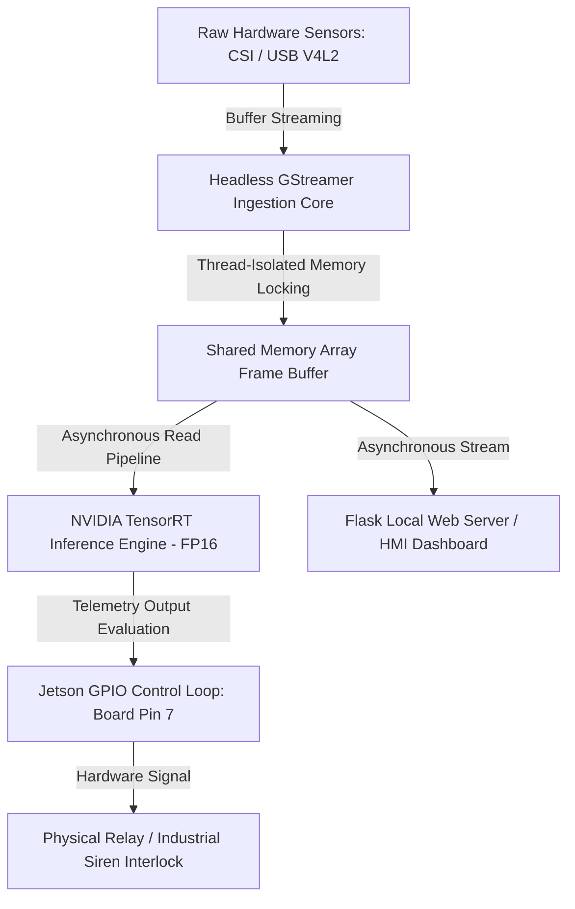

# 🛠️ EdgeForge-Vision

> **An Open-Source Agile Edge-AI Framework for Accelerated Industrial Inspection, Real-Time Object Telemetry, and Asynchronous HMI Controls on NVIDIA Jetson.**

EdgeForge-Vision is a production-grade, high-speed edge computing vision framework engineered for high-throughput factory automation, predictive sorting pipelines, and localized edge telemetry. Powered natively by the **NVIDIA Jetson Orin Nano**, this framework bridges hardware-accelerated camera ingestion modules directly with physical automation relays (via GPIO) and real-time asynchronous web HMI dashboards.

---

## 📋 Table of Contents

- [Core Architecture](#-core-architecture)
- [Hardware & Software Stack](#-hardware--software-stack)
- [Model Weights & Runtime Prerequisites](#-model-weights--runtime-prerequisites)
- [Industrial Application Use Cases](#-industrial-application-use-cases)
- [Custom Adaptation Guide](#-custom-adaptation-guide)
- [Repository Structure](#-repository-structure)
- [Roadmap](#-engineering-roadmap)

---

## 🏗️ Core Architecture

EdgeForge-Vision is built on a **decoupled, multi-threaded pipeline design pattern**. The core engine execution loops are completely agnostic to specific deep learning model weights, enabling seamless redeployment across diverse industrial contexts.



### 1. Hardware Interface Layers

- **Vision Acquisition:** High-speed CSI / USB webcams streaming via the Linux V4L2 kernel abstraction layer.
- **Edge Compute Platform:** NVIDIA Jetson Orin Nano Developer Kit utilizing SoM shared-memory architecture.
- **Automation Interlocks:** Low-latency physical relays and alerting devices natively bound to Jetson GPIO (Board Pin 7).

### 2. Software Concurrency Infrastructure

- **Ingestion Core:** Headless GStreamer pipeline streaming hardware frame buffers directly into volatile memory, bypassing desktop window management for maximum throughput.
- **Inference Pipeline:** NVIDIA TensorRT execution context deploying FP16 half-precision quantization directly onto Jetson CUDA cores.
- **Concurrency Model:** Strict isolation between the vision loop and web networking layer using `threading.Lock()` synchronization wrappers to guarantee zero race conditions across shared buffers.
- **HMI Server Node:** Lightweight asynchronous Flask REST server rendering industrial status over an auto-booting responsive dark-themed dashboard.

---

## ⚙️ Hardware & Software Stack

| Component | Details |
|---|---|
| Edge Platform | NVIDIA Jetson Orin Nano Developer Kit |
| Camera Input | CSI Camera / USB Webcam (V4L2) |
| Inference Runtime | NVIDIA TensorRT (FP16) |
| ML Framework | PyTorch + Ultralytics YOLOv8 |
| Streaming Backend | GStreamer (headless) |
| HMI Server | Flask (async) |
| GPIO Control | Jetson.GPIO (Board Pin 7) |
| Language | Python 3.8 |

---

## 📦 Model Weights & Runtime Prerequisites

Production model weights (`.pt`, `.onnx`, `.engine`) and the Jetson-optimized PyTorch wheel (~164 MB) are excluded from the main git tree to keep the repository lightweight.

**Download all validated assets from the [Releases page → Tag v1.0.0](../../releases/tag/v1.0.0).**

After downloading, place assets into your workspace at the following paths:

```
EdgeForge-Vision/
└── models/
    ├── best.pt
    ├── yolov8n.pt
    ├── best.engine
    ├── yolov8n.engine
    └── torch-2.0.0+nv23.05-cp38-cp38-linux_aarch64.whl
```

---

## 🏭 Industrial Application Use Cases

Because EdgeForge-Vision decouples hardware ingestion from neural network model parameters, it can be redeployed across diverse industrial setups without modifying the core multi-threaded pipeline logic.

| Industry Sector | Telemetry Task | Custom Model Target | GPIO Response (Pin 7) |
|---|---|---|---|
| Agricultural Automation | Coconut grade & defect counting | `coconut_weights.engine` | Rejects undersized or damaged husks via pneumatic sorting valves |
| Beverage Packaging | Bottle volumetric fill-level control | `bottle_counter.engine` | Diverts unsealed or underfilled containers into quarantine bins |
| Pharma Operations | Blister pack defective pill tracking | `pill_anomaly.engine` | Halts delivery conveyors and triggers warning sirens |
| Logistics & Warehousing | Package parcel sorting & classification | `package_type.engine` | Activates directional actuators to route boxes into correct chutes |

---

## 🔧 Custom Adaptation Guide

Follow these steps to retrain the model and adapt the framework to any target industrial context.

### Step 1 — Collect & Train Custom Weights

Label a domain-specific dataset using any annotation tool, then train a custom YOLOv8 model:

```bash
pip install ultralytics
yolo task=detect mode=train model=yolov8n.pt data=your_dataset.yaml epochs=100 imgsz=640
```

Extract `best.pt` from the output directory once training completes.

---

### Step 2 — Export to TensorRT Engine

Compile your `.pt` weights to a hardware-accelerated TensorRT binary on the Jetson:

```bash
# Quantizes to FP16 half-precision on native CUDA cores
./venv/bin/python3 -c "
from ultralytics import YOLO
model = YOLO('best.pt')
model.export(format='engine', device=0, half=True)
"
```

This outputs `best.engine` — a serialized, hardware-optimized binary for low-latency inference.

---

### Step 3 — Deploy Weights to Workspace

Transfer `best.pt` and `best.engine` to your edge device and place them in:

```
EdgeForge-Vision/models/
```

---

### Step 4 — Configure Runtime Parameters

Open `ui.py` and update the global configuration block at the top of the file:

```python
# ==============================================================================
# INDUSTRIAL RUNTIME PARAMETERS — CONFIGURATION
# ==============================================================================

# 1. Path to your compiled TensorRT binary
MODEL_PATH = "models/best.engine"

# 2. Class names matching your custom model's training indices
CLASS_NAMES = ["Bottle-Full", "Bottle-Empty", "Cap-Defect"]

# 3. Target class that triggers the GPIO relay alert
CRITICAL_ALERT_CLASS = "Cap-Defect"

# ==============================================================================
```

---

### Step 5 — Launch & Monitor

Start the framework from the terminal:

```bash
sudo ./venv/bin/python3 ui.py
```

Open a browser and navigate to `http://localhost:5000` to view the real-time factory HMI dashboard.

---

## 📁 Repository Structure

```
EdgeForge-Vision/
├── camera/               # Thread-isolated camera ingestion modules (CSI / USB handlers)
├── models/               # Local workspace for TensorRT (.engine) binaries and weights
│   └── .gitkeep          # Placeholder — populate with assets from Releases
├── static/               # HMI UI stylesheets and dark-themed industrial assets
│   └── .gitkeep          # Placeholder — populated at runtime
├── templates/            # HTML5 responsive real-time HMI dashboard screens
├── ui.py                 # Core async backend engine & thread lock coordinator
├── .gitignore            # Binary / OS-level exclusion rules
└── README.md             # Deployment & adaptation documentation
```

---

## 🗺️ Engineering Roadmap

- [ ] Integrate multi-stream camera orchestration via NVIDIA DeepStream SDK
- [ ] Embed industrial fieldbus protocol layers (Modbus/TCP, MQTT, OPC-UA) for PLC network synchronization
- [ ] Automated batch reporting with localized PDF compliance log generation

---

## 📄 License

This project is open-source. See [LICENSE](LICENSE) for details.
